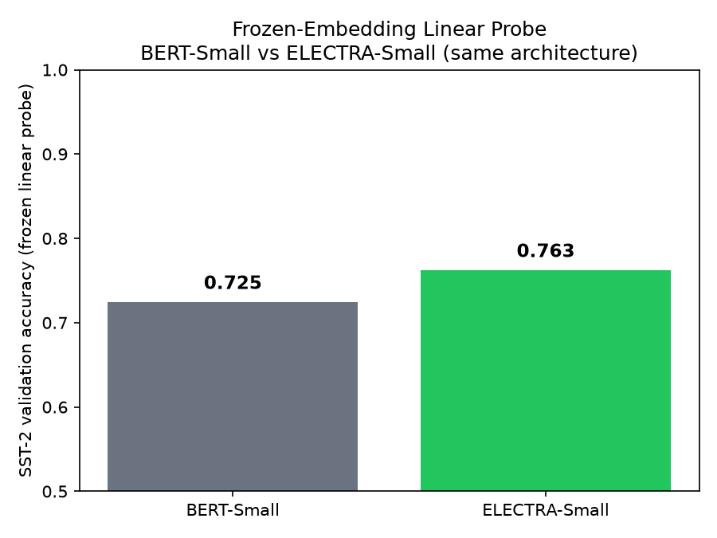

# ELECTRA: Replaced Token Detection — Interactive Demo + Independent Probe

An interactive exploration of **ELECTRA** (Clark et al., ICLR 2020), built for a graduate NLP course and extended with an independent experiment testing the paper's core claim.

**🔗 Live demo:** https://huggingface.co/spaces/VenkM/electra-rtd-demo


## What's in this repo

- **`app.py`** — an interactive Gradio app running ELECTRA's actual pretrained generator and discriminator checkpoints live. Mask a word, see the generator's replacement suggestions, then watch the discriminator classify every token in the sentence as real or replaced.
- **`probe_experiment.py`** — an independent frozen-embedding linear probe comparing **size-matched** BERT-Small and ELECTRA-Small (identical 12-layer, 256-hidden architecture, neither fine-tuned) on SST-2 sentiment classification.

## The paper, in one paragraph

BERT's masked-language-modeling only computes a training loss on the ~15% of tokens it masks. ELECTRA replaces that with **Replaced Token Detection**: a small generator proposes plausible fake tokens, and a discriminator — the actual ELECTRA model — classifies *every* token in the sequence as real or replaced. Loss over 100% of tokens instead of 15% is the paper's central efficiency claim, and it lets a model trained on a single GPU in 4 days outperform GPT despite using ~30x less compute.

## Probe result



| Model | Architecture | Frozen SST-2 probe accuracy |
|---|---|---|
| BERT-Small | 12 layers, 256 hidden, 4 heads | 72.5% |
| ELECTRA-Small | 12 layers, 256 hidden, 4 heads | 76.3% |

Same architecture, same linear classifier, neither model fine-tuned — the only difference is the pretraining objective. This is a small-scale, single-run, single-task test (not the paper's full GLUE-wide fine-tuning protocol, and not a substitute for it), but it's directionally consistent with ELECTRA's central claim: at matched size, RTD pretraining produces more linearly separable representations than MLM, even before any task-specific fine-tuning happens.

## A finding beyond the paper's own claims

While building the demo, I checked the actual released `google/electra-small-generator` checkpoint against the architecture the paper specifies. Table 6 of the paper calls for a generator 1/4 the discriminator's hidden size for the Small configuration. The publicly shipped checkpoint doesn't match — it's full-size, identical to the discriminator. A verifiable gap between the paper's documented method and its released artifact, independent of anything in this repo's own code.

## Running locally

```bash
git clone <this-repo-url>
cd <this-repo-name>

# Interactive demo
pip install -r requirements.txt
python app.py

# Linear probe (reproduces probe_comparison.png)
pip install -r requirements_probe.txt
python probe_experiment.py
```

## References

Clark, K., Luong, M.T., Le, Q.V., & Manning, C.D. (2020). *ELECTRA: Pre-training Text Encoders as Discriminators Rather Than Generators.* ICLR 2020.

Bandy, J., & Vincent, N. (2021). *Addressing Documentation Debt in Machine Learning Research: A Retrospective Datasheet for BookCorpus.*

## License

MIT
